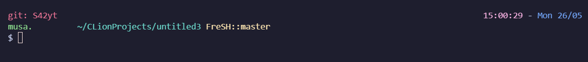
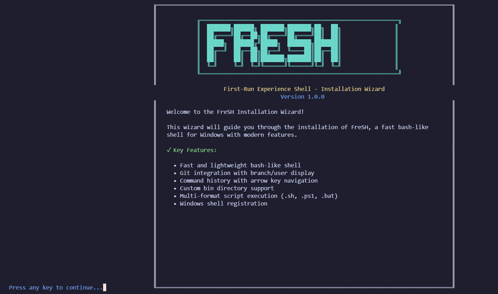

# FreSH - First-Run Experience Shell

# Dawg i dont have windows even anymore i think im gonna rewrite this for mac lmao

A fast bash-like shell written in C for Windows.



## Installation




### Wizard Installation

1. Download the latest `FreSH-Setup.exe` from the releases page
2. Double-click `FreSH-Setup.exe`
3. Follow the installation wizard:
   - Choose **"Install for current user only"** (recommended)
   - Or **"Install globally for all users"** (requires admin rights)
4. After installation, open any terminal and type `FreSH`

## Building from Source

### Prerequisites
- [GCC Compiler](https://gcc.gnu.org/)
- [Astyle](http://astyle.sourceforge.net/) (for formatting)
- Any IDE with proper C support

### Development

There are 2 versions to build FreSH:

- [Powershell File(.ps1)](./build.ps1)
- [Shell File(.sh)](./build.sh)

Both can be used on Windows.
(For .sh you may need a bash compiling terminal like WSL or Git Bash)

Format code:
```sh
astyle --style=google --indent=spaces=4 --suffix=none *.c *.h
```

Build FreSH:
```sh
./build.sh
```

Start the Shell (after building):
```sh
./build/FreSH.exe
```


### Native Commands

```sh
help            Show the help message
exit/quit       Exit the shell
cd [dir]        Change directory
pwd             Print working directory
ls              List directory contents 
clear           Clear the screen completely
history         Show command history
binlist         Show registered bin commands
which <cmd>     Show path to command
echo <text>     Print text to screen
shinfo          Show shell script support info
gitinfo         Show git repository information
gitconfig       Configure git display 
```

## Features

- **Cross-platform**: Built for Windows with full CMD/PowerShell compatibility
- **Git Integration**: Shows current branch, user, and repository info automatically
- **Command History**: Navigate through previous commands with arrow keys
- **Bin Commands**: Automatically detects and registers executables in user bin folders
- **Script Support**: Supports .exe, .bat, .cmd, .ps1, .sh, and other executable types
- **Easy Installation**: One-click installer with user and global installation options
- **Self-contained**: Bundled installer includes everything needed
- **Uninstaller**: Clean removal through Control Panel or dedicated uninstaller

## Uninstalling

To uninstall FreSH:
1. Go to **Control Panel > Programs and Features**
2. Find **"FreSH - First-Run Experience Shell"** and click **Uninstall**

Or run the uninstaller directly from the installation directory.

## License

This project is Licensed under a [MIT LICENSE](LICENSE)

## Contributing
_Soon_
