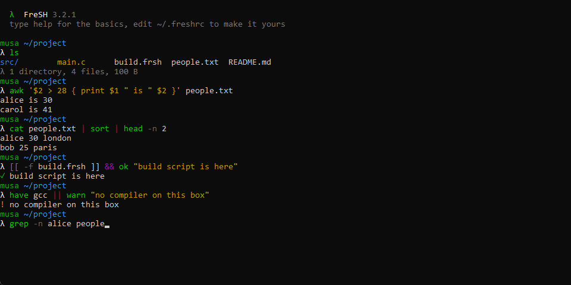
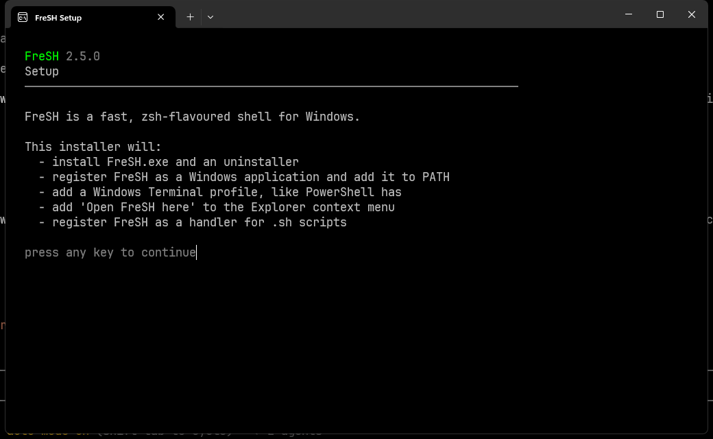

<p align="center">
  
</p>

<h1 align="center">FreSH</h1>

<p align="center">
  <b>Runs bash scripts on Windows, unchanged.</b><br>
  No WSL, no MSYS2, no Git Bash. One executable, written in C, starts in 22 ms.
</p>

What "unchanged" means is written down honestly in
[bash compatibility](docs/bash.md): what works, what does not, and why. Every
line under **Works** has a test, and on every push CI runs the same scripts
through real bash on Linux and through FreSH on Windows and fails the build on
any difference.



```sh
scoop bucket add fresh https://github.com/S42yt/FreSH
scoop install fresh/fresh              # or: scoop install fresh/fresh-portable
```

Or download `FreSH.exe` from the [releases](https://github.com/S42yt/FreSH/releases)
and put it on your `PATH`. Nothing else is needed, and
[verifying the download](docs/verifying.md) takes one command.

**Docs:** [bash compatibility](docs/bash.md), [awk](docs/awk.md),
[benchmarks](docs/benchmarks.md), [scripting](docs/scripting.md),
[configuration](docs/configuration.md), [shortcuts](docs/shortcuts.md),
[themes](docs/themes.md), [plugins](docs/plugins.md),
[command reference](docs/commands.md), [how it fails](docs/errors.md).

## Installation

### Scoop

```sh
scoop bucket add fresh https://github.com/S42yt/FreSH
scoop install fresh/fresh              # the full install
scoop install fresh/fresh-portable     # the single executable
```

Scoop verifies the hash itself, so there is no SmartScreen prompt. A Scoop
bucket is just a git repository, which is why this works straight from here.

### winget

Not yet. `winget install S42yt.FreSH` searches Microsoft's community index,
which FreSH has not been submitted to, so it answers *no package found*. The
manifests are written, validated and laid out the way that index expects, in
[manifests](manifests/), so from a clone this works today:

```powershell
winget install --manifest manifests\S42yt.FreSH\26.10.0
```

This section loses the "not yet" when the pull request to
`microsoft/winget-pkgs` is merged.

### Portable

Download `FreSH.exe`, put it anywhere on your `PATH`, run `FreSH`. No installer,
no registry, no administrator. Settings still live in `~/.freshrc`, and nothing
about the shell depends on having been installed.

### The installer



1. Download `FreSH-Setup.exe` from the releases page
2. Run it and pick **Just for me** (no admin) or **For all users**
3. Say whether FreSH should become your default shell
4. Open a new terminal and type `FreSH`

The installer registers FreSH the way Windows expects a shell to be
registered:

- adds a **Windows Terminal profile**, so FreSH sits next to PowerShell in the
  dropdown
- optionally makes it the **default profile**, backing up `settings.json` first
- registers under **App Paths**, so `FreSH` works from the Run dialog
- adds it to **PATH**
- adds **Open FreSH here** to the Explorer folder context menu
- registers FreSH as a handler for `.frsh` and `.sh` scripts
- creates Start Menu and Desktop shortcuts
- adds an entry to **Apps & Features** with a working uninstaller

Restart Windows Terminal after installing. Fragments are only read at startup.

Silent install:

```
FreSH-Setup.exe /silent /user /default
```

Uninstall from *Settings > Apps > FreSH*, or run `Uninstall-FreSH.exe` from the
install folder.

### Checking what you downloaded

FreSH is not code signed yet, so Windows shows a SmartScreen prompt the first
time you run a downloaded binary. Rather than tell you to click through it,
every release ships `SHA256SUMS.txt` and a signed build provenance statement:

```
gh attestation verify FreSH.exe --repo S42yt/FreSH
```

That proves the file came out of a GitHub runner, from this repository, from
the commit the release names. More in [verifying a download](docs/verifying.md)
and the [signing policy](docs/code-signing.md).

## Updating

FreSH updates itself:

```sh
fresh update           # check github, download and install the newest release
fresh update --check   # only tell me whether there is one
fresh update --pre       # take prereleases too
fresh update --selector  # browse every release and install any of them
fresh                    # version, where things live, active theme and plugins
```

Prereleases are tagged `26.10.1-prerelease-1` and are never offered by a plain
`fresh update`, so you only get one by asking.

`--selector` opens a small browser over every release there has ever been,
newest first: releases, prereleases and experiments alike. Arrows move, left
and right switch pages, enter installs the one under the cursor, escape leaves
without touching anything:

```
  14 releases, page 1 of 2
  ❯ 26.11.0 prerelease 3  installed
    26.11.0 experiment 2
    26.10.1 prerelease 3
    26.10.0 release
    ...
  ↑↓ move   ←→ page   enter install   esc leave
```

Outside a terminal, or with `--check`, it prints the same list numbered and
plain so scripts can read it.

Tags carry the kind in the middle. A `-prerelease-n` is the next version being
tested and is what `fresh update --pre` gives you. Anything else, such as
`-experiment-n`, is a branch being tried out: the selector lists it and will
install it if you pick it, but `--pre` never offers one, so an experiment
cannot arrive by accident.

Installing closes the shell, because Windows will not replace a running
executable. Open a new one when it is done.


## Why it is quick

| Shell | start, run nothing, exit |
| --- | --- |
| **`FreSH -c exit`** | **11.8 ms** |
| `cmd /c exit` | 12.9 ms |
| `bash -c exit` (Git Bash) | 236 ms |
| `powershell -c exit` | 271 ms |
| `pwsh -c exit` | 570 ms |

Starting and exiting is not what a shell is for, though. The same jobs, once
through `cmd.exe` and once through FreSH:

| Task | cmd | FreSH |
| --- | --- | --- |
| print one line | 23 ms | **18 ms** |
| sort a 2000 line file | 23 ms | **20 ms** |
| count matching lines in a 2000 line file | 24 ms | **22 ms** |

FreSH wins all three because `sort`, `grep` and `echo` run inside the shell,
while cmd spawns a process for each. Since 26.11 it wins the empty case too:
the libraries behind `md5sum`, `id` and `copy` used to load before `main` ran,
and now they load when something asks for them.

Best of sixty on an AMD Ryzen 3 7330U with Defender on, measured by
`tools/bench.frsh`, which measures every shell the same way. `FRESH_TIMING=1`
prints where a start goes, `before main` included. The full table, and the
padded probe that proved the cost was imports rather than bytes, are in
[benchmarks](docs/benchmarks.md).

## Two interpreters, written from scratch

FreSH does not shell out for the parts a unix script leans on:

- **`src/awk.c`** is a real awk. A lexer, a recursive descent parser, an AST and
  a tree walking interpreter, with `sub`, `gsub`, `match`, `sprintf`, ranges,
  user functions, `getline`, output redirection, and the special variables. The
  [subset is documented](docs/awk.md) and everything documented has a test.
- **`src/regex.c`** is a backtracking regular expression engine, shared by
  `grep`, `sed`, `awk` and `[[ str =~ re ]]`, with basic and extended syntax.

Both are fuzzed with libFuzzer under the address and undefined sanitizers, along
with the shell's own parser. See [fuzz](fuzz/README.md).

The test suite is written **in FreSH**, using arrays, `${var##*/}`, `source` and
globbing, and run by FreSH itself, so it is a conformance suite and a dogfood
test at once: [tests](tests/).

## What you get

**A real shell**

- pipelines, `&&`, `||`, `;`, background `&`
- redirection: `>`, `>>`, `<`, `2>`, `2>&1`
- quoting, `\` escapes, globs (`*.c`, `src/?.h`)
- variables, `export`, `$?`, `$#`, `$@`, `$1`, `${VAR:-default}`, `${#VAR}`
- command substitution `$(...)` and `` `...` ``, arithmetic `$((1 + 2))`
- `if / elif / else / fi`, `while`, `until`, `for`, `select`, `case`,
  `{ ...; }`, `[[ ... ]]`, `!`
- indexed and associative arrays, `declare -a`, `declare -A`
- shell functions with `local` scope, `return`, `break`, `continue`, `shift`
- here documents, process substitution `<(...)` and `>(...)`
- brace expansion, `set -e`, `set -u`, `set -x`, `trap`, `jobs`, `wait`
- regular expressions in `grep`, `sed` and `[[ str =~ re ]]`
- `.frsh` and `.sh` scripts run natively, FreSH is the interpreter

**zsh style line editing**

| Key | Action |
| --- | --- |
| `Tab` | complete commands, files, directories and `$variables` |
| `Tab` again | cycle through the candidates |
| `Up` / `Down` | history, filtered by what you have already typed |
| `Right` / `End` | accept the greyed out suggestion from history |
| `Ctrl+R` | search history |
| `Ctrl+A` / `Ctrl+E` | start and end of line |
| `Ctrl+Backspace` / `Ctrl+W` | delete the previous word |
| `Ctrl+U` / `Ctrl+K` | cut to start, cut to end |
| `Ctrl+Left` / `Ctrl+Right` | move by word |
| `Ctrl+L` | clear the screen |
| `Ctrl+C` | abandon the line |
| `Ctrl+D` | exit on an empty line |

Commands are colour highlighted as you type: known commands green, unknown
red, strings and variable assignments yellow, variables cyan, operators
magenta.

## PowerShell and cmd, still here when you want them

Cmdlets and cmd builtins run without leaving FreSH. The line goes to whichever
shell understands it, syntax intact:

```sh
Get-Process | Select-Object -First 5 -ExpandProperty Name
dir /s /b
ps1 "Get-Service | Where-Object Status -eq Running"
cmd                       # an interactive cmd.exe, if you really want one
```

Cmdlet names complete on Tab. `FRESH_FOREIGN=0` switches the automatic
routing off.

## Themes

Six themes ship with the shell, they are plain FreSH scripts in
`~/.fresh/themes`, and writing one is a single file. The details are in
[themes](docs/themes.md); the short version:

```
fresh       two lines, lambda, git branch      (default)
minimal     one line, path and an arrow
classic     the bash look, user@host:path$
powerline   block segments, needs a powerline font
lambda      just the lambda, path on the right
full        time, user, host, path, git, exit code
```

```sh
theme              # list them, the active one is marked
theme minimal      # switch right now
```

Set `FRESH_THEME=minimal` in `~/.freshrc` to keep it. Your own theme is one
file, with zsh style escapes such as `%~`, `%g` and `%F{magenta}`:

```sh
# ~/.fresh/themes/mine.theme
FRESH_PROMPT='%F{magenta}%~%f%g\n%F{white}%#%f '
FRESH_RPROMPT='%t'
```

## Plugins

Plugins are FreSH scripts in `~/.fresh/plugins`, loaded by name:

```sh
FRESH_PLUGINS="git dirs sys"     # in ~/.freshrc
```

```
git     g gs ga gc gco gb gd gl gp gpl, groot, gclean
dirs    .. ... .... ll la l, mkcd, up
sys     path reload h c, ports, psg
edit    e rc, edit
```

```sh
plugin             # list them
plugin load git    # load one for this session
```

Adding your own means dropping `name.plugin` in the folder and adding `name`
to `FRESH_PLUGINS`. Aliases, functions and variables all work.

## Configuration

`~/.freshrc` is created on first run and sourced every start. It is grouped
into startup, theme and plugins, prompt, editing, history and aliases:

```sh
FRESH_BANNER=1            # banner on start
FRESH_BANNER_TEXT=""      # your own line instead
FRESH_THEME=fresh
FRESH_PLUGINS="git dirs sys"
FRESH_FOREIGN=1           # cmdlets and cmd builtins run in their own shell
FRESH_PROMPT_CHAR="λ"
FRESH_PATH_DEPTH=3        # trailing path components to show
FRESH_SHOW_USER=1
FRESH_SHOW_GIT=1
FRESH_SHOW_GIT_DIRTY=1
FRESH_SHOW_RPROMPT=1
FRESH_TITLE=1             # current directory in the window title
FRESH_COLOR=1
FRESH_HIGHLIGHT=1
FRESH_SUGGEST=1
HISTSIZE=5000
```

History lives in `~/.fresh_history`.

## Bundled commands

Windows ships none of the tools a bash or zsh user expects, so FreSH carries
its own:

```
awk       basename  cat     chmod   cmp     column  comm    cp      cut
date      df        diff    dirname du      env     expr    file    find
fold      groups    grep    head    hostname id     kill    ln      md5sum
mkdir     mktemp    mv      nl      open    paste   pkill   printf  ps
realpath  rev       rm      rmdir   sed     seq     sha1sum sha256sum
shuf      sleep     sort    stat    tac     tail    tee     touch   tr
uname     uniq      wc      wget    whoami  xargs   yes
```

These are fallbacks. If a real executable of the same name is on `PATH` it
wins, so an installed GNU `grep` or `gawk` takes over. The exceptions are
`find` and `sort`, where the Windows tools of that name do something entirely
different, so FreSH always uses its own.

`grep` and `sed` take real regular expressions, basic by default and extended
with `-E`. `awk` is a real interpreter with `BEGIN`/`END`, patterns, fields,
`NR`/`NF`/`FS`, control flow and `printf`.

`curl` and `tar` are not bundled because Windows 10 and later already ship
both in System32.

## Builtins

```
alias   break   cd      clear   continue  declare  die     echo    eval
exit    export  false   fresh   gitinfo   have     help    history jobs
local   ls      ok      plugin  ps1       pwd      read    rehash  return
say     set     shift   source  test  [   theme    trap    true    type
typeset unalias unset   wait    warn      which    .
```

External programs are resolved through `PATH` using `PATHEXT`, plus `.frsh`,
`.ps1` and `.sh`. `.ps1` files are handed to PowerShell, `.bat` and `.cmd` to
cmd.exe, `.frsh` and `.sh` files are executed by FreSH itself. Full details in
the [command reference](docs/commands.md).

## Claude Code

[fresh-claude](https://github.com/S42yt/fresh-claude) is a Claude Code plugin
that makes Claude run its shell commands through FreSH instead of PowerShell:

```
/plugin marketplace add S42yt/fresh-claude
/plugin install fresh-claude@fresh-claude
/fresh on
```

## Usage outside the prompt

```sh
FreSH script.sh arg1 arg2   # run a script
FreSH -c "echo hello"       # run one command
FreSH --norc -c "echo hi"   # skip ~/.freshrc, the theme and the plugins
FreSH C:\some\folder        # start in a folder
FreSH --version
```

## Building from source

Requires GCC (MinGW-w64 or MSYS2). No other dependencies.

```sh
./build.sh
```

or, in PowerShell:

```powershell
.\build.ps1
```

Both produce `build/FreSH.exe` and `build/FreSH-Setup.exe`. The icon is
generated by `tools/makeicon.c` and the installer embeds `FreSH.exe` as a byte
array generated by `tools/bin2c.c`, so the setup binary is self contained.

CMake works too:

```sh
cmake -B build && cmake --build build
```

Format before committing:

```sh
astyle --style=google --indent=spaces=4 --suffix=none src/*.c src/*.h
```

## Tests

```sh
FreSH tests/run.frsh                       # the suite, written in FreSH
tests/diff/record.sh bash tests/diff/expected
tests/diff/record.sh "$PWD/build/FreSH.exe" tests/diff/actual
tests/diff/compare.sh tests/diff/expected tests/diff/actual
fuzz/build.sh && fuzz/build/fuzz_parser -runs=0 fuzz/corpus/parser
```

CI runs all three on every push: the suite, the bash differential, and the fuzz
corpus under the address and undefined sanitizers.

## License

GNU General Public License v3.0, see [LICENSE](LICENSE).

## Contributing

Issues and pull requests welcome. [CONTRIBUTING.md](CONTRIBUTING.md) has the
branch naming, the commit style, what a change needs to bring with it, and how
releases are cut. The short version: branch as `feat/`, `fix/`, `perf/`,
`docs/`, `test/`, `ci/`, `refactor/` or `chore/` followed by kebab case, open a
pull request, keep CI green.
